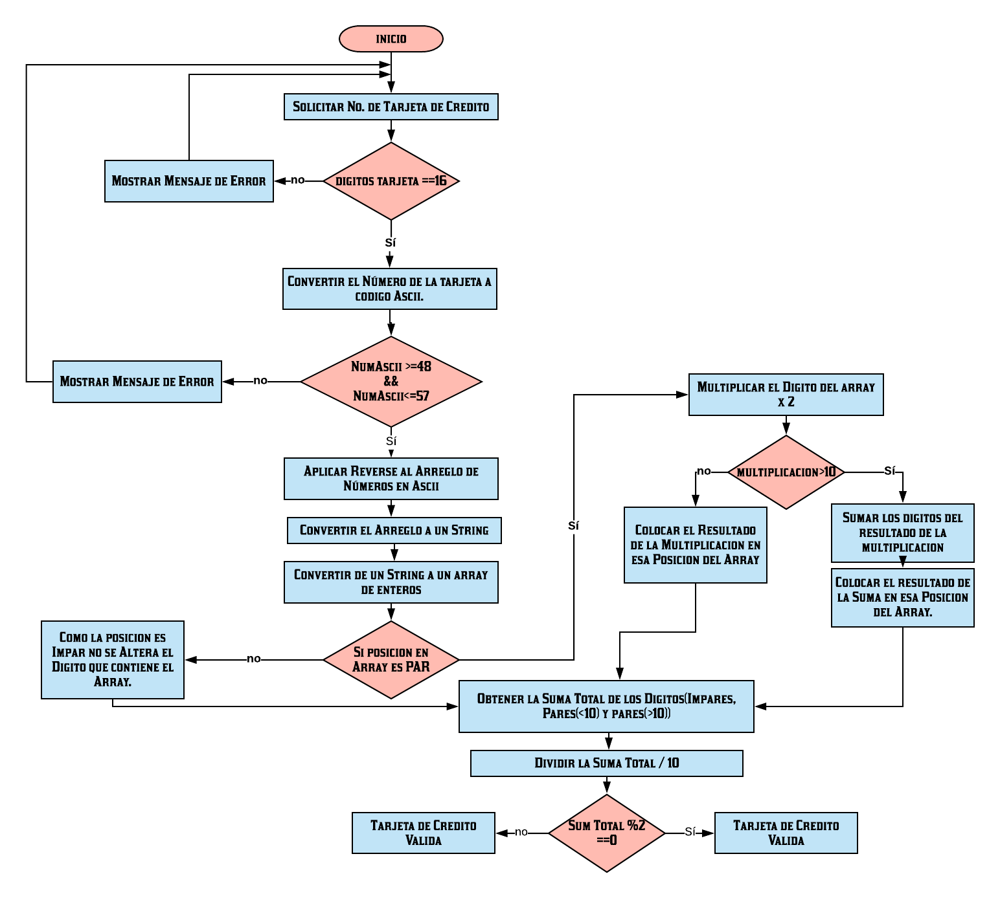

# TARJETA DE CREDITO
## Instrucciones:
Crea una web que pida, por medio de un prompt(), el número de una tarjeta de crédito y confirme su validez según el algoritmo de Luhn. Lee este blog que explica cómo funciona el algoritmo de Luhn.

### Algoritmo de Luhn:
```javascript
COMO FUNCIONA EL ALGORITMO DE LUHN:
* Los Números de la Tarjeta de Credito (Digito del 0 al 9),
son invertidos.
* Si la Posicion es Impar se suman los digitos.
* Si la posicion es Par se Multiplican por 2
* Si el resultado de  la multiplicacion es >10 se suman
los digitos de esa multiplicacion.
* Una vez Obtenidos todos los digitos se hace una suma total.
* Se divide el resultado de la Suma entre 10, si el
 residuo es 0 ES UNA TARJETA VALIDA.
```
PARA VER MAS DA CLICK AQUI---->[ALGORITMO DE LUHN](https://www.quobit.mx/asi-funciona-el-algoritmo-de-luhn-para-generar-numeros-de-tarjetas-de-credito.html "Algoritmo luhn")

### Consideraciones:
* El código debe estar compuesto por 1 función: isValidCard.
* El usuario no debe poder ingresar un campo vacío.

## Pseudocodigo:
```javascript
1. Solicitar al Usuario que Introduzca su número de Tarjeta
de Credito.
2. Validar que el programa solo acepte 16 digitos.
3. Validar que el programa solo acepte digitos del 0-9.
4. Validar que el usuario no ingrese espacios vacios.
5. Utilizar el Algoritmo de Luhn de la siguiente forma:
6. Si el Digito se encuentra en una posicion Impar no
se modifica y se dejara el digito que se encuentra en esa
posición.
7. Si el Digito se encuentra en una posicion Par se
multiplicara por 2.
8. Si el resultado de la multiplicacion es <10, el resultado de la multiplicación
 será el nuevo valor que se colocorá en esa posición.
9. Si el resultado de la multiplicación es >10, se
sumaran ambos digitos(eje 1+0), y el resultado de esa suma.
sera  el nuevo valor que se colocara en esa posición.
10. Se sumaran cada uno de los digitos y el resultado de esa suma se dividirá entre 10;
11. Si el residuo de la division es igual a 0 entonces es Una Tarjeta Valida,
de lo contrario es una tarjeta invalida.
```
## Diagrama de Flujo:

